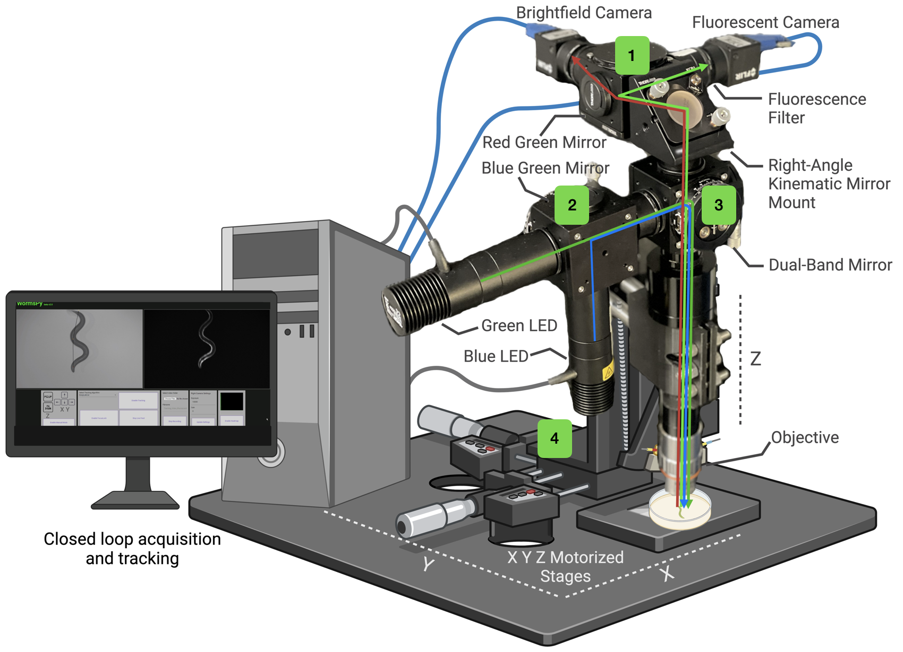

# WormsPy

WormsPy is a software for controlling an open source tracking fluorescence microscope. It is designed to utilize two cameras, shifted to different wavelengths to allow simultaneous tracking and behavioural measurements with epifluorescence imaging. The dual recording approach using the same light path allows the user to align the images in post and make inferences about how neural activity affects behaviour and how the animal's interactions with its environment affect neural activity. While WormsPy was developed for calcium imaging in head sensory and interneurons in C. elegans, its modular design and low cost allows it to be iterated on by other researchers and find applications in new fields

 

## Getting started with WormsPy

WormSpy allows you to track the movements of a single animal whilst ensuring it always stays in focus. It also allows you to simultaneously record both video feeds. The left video feed is recorded as a compressed .avi file whilst the right video feed is recorded as a series of uncompressed 16-bit .tiff files to enable further feature extraction.

### Minimum requirements
Minimum requirements to use WormSpy:
- 2x Spinnaker compatible cameras
- XY Zaber motor stage (Controlled with Binary Commands) 
- Z Zaber motor stage (Controlled with Binary Commands)
- A CUDA capable NVidia GPU (Preferrably with Tensor Cores)

Spinnaker cameras can be replaced with any OpenCV compatible cameras, although EasyPySpin will have to be replaced with OpenCV.
See Build Guide for more information

### Getting started with WormsPy
1. Miniconda / Anaconda 
2. `conda create --name wormspy --file requirements.txt`
3. Ensure only the required two cameras are connected to the computer.
4. Identify the serial port for the XY motors and the serial port for the Z motor. 
If all three motors are connected via the same serial port, you will have to modify the `video_feed()` function in `app.py` such that only one serial port is open. 
5. Open the ZaberLauncher application, which acts as an intermediary messenger to the motors.
6. Run StartWormSpy.bat
7. In your browser visit `localhost:5000`

## Developer's Notes
More information for those interested in adapting WormSpy for their use case.

### Frontend 
The frontend of WormsPy was developed using Angular (HTML/SCSS/TS). To make adjustments the frontend, the installation of NodeJs is required. Run `npm install` in the `wormspy` folder after initially downloading the files. Adjustments to the frontend can be made in the live-feed component found in `wormspy/src/app/live-feed`. 

To continue using flask as a web server and maintain `StartWormSpy.bat` as an easy launch option, follow these steps:
1. Use `ng build` to create new production files in the `wormspy/dist` folder. 
2. Place the `index.html` file into the `production/template` folder. 
3. Place all other files found in the dist folder into the `production/static` folder. 
4. In the `index.html` file, edit all import statements following this template: `<src>/<href>="{{url_for('static', filename='<filename>.js')}}"`

### Backend
WormSpy uses a Python Flask web server (`app.py`) to communicate with the frontend. A combination of the OpenCV and EasyPySpin libraries are used to communicate with the cameras. The Zaber Motion **Binary** library is used to control the Zaber motors. The DeepLabCut (DLC) Live library is used to identify _C. elegans_ in the live feed. 

If you would like to train and use your own DLC model, place your model in the `DLC_models` folder and replace the `skeleton` folder in the `DLCLive` function of the `video_feed` method.

For more detailed programmatical information about WormSpy, refer to the inline comments found in `app.py`.  

## License

WormSpy was developed by Sebastian Wittekindt and Lennard Wittekindt at McGill University. Funded by the Canadian Institute for Health Research.

Provided as open source software under the MIT license, view the [license](LICENSE.TXT) for details.

## WormsPy Dual Camera Build Guide

Overview: *[#] refers to the index number of the component in the table below
We recommend using c-mount compatible components for ease of assembly and to minimise 
converters. The core of the build is three ThorLabs 30mm cage cubes [1] that have a blank cover 
plate [2] on one side and the mirrors on the other side, mounted into the cage cubes via precision 
rotation or fixed platforms [3,4,5]. Components are connected to the cage cubes via various 
adjustable c-mount extension tubes as needed [6]. Our build is designed for ratiometric calcium 
imaging at high magnifications and this guide will use the components we selected for that 
purpose, but they can easily be swapped as needed.

1. Imaging Cube:
The imaging cube consists of two computer vision cameras [7] selected to have high quantum efficiency for maximum sensitivity to phasic calcium transients. Red and green emission filters [8,9] are mounted on the inside of a short lens tube [10] just before the camera. The bandwidth of emitted light is split via a red/green mirror [11] mounted on a fixed cage cube platform [4,5] as we found this to be sufficient to align the cameras. This can also be swapped out for a precision rotation platform [3,5]. The imaging cube is connected to the light path cube via a right angle kinematic mirror mount for X Y alignment [12,13].

2. LED Excitation Cube:
The LED excitation cube consists of two single-colour mounted LEDs in the blue and green wavelength [14,15] driven by an LED Driver [16]. The lasers are diffused via an aspheric condenser lens [17] mounted in an SM30 Lens Tube [18] with a retaining ring [19]. A blue/green mirror [20] mounted on a precision rotation platform [3,5] directs both LEDs onto the 
central light-path cube.

3. Light-Path Cube:
The light-path cube is connected to the other two cubes via adjustable c-mount extension tubes [6] and houses a dichroic mirror [21] mounted on a precision rotation platform [3,5]. The bottom of the cube is attached to a tube lens [22], a 100mm lens tube [23] and an infinity-corrected objective [24] that focuses the light on the sample.

4. Motor Platforms:
The entire imaging platform is attached to the motors via a 3D printed clamp [27] (commercial clamps are also available) that attaches to the 100mm lens tube [23]. The clamp is in turn screwed onto a right angle mounting plate [25,26] that is attached to the top of the vertical lift stage [28,29,30,31] that controls the Z axis. The vertical lift stage is mounted on top of two TSB translational stages [32,33,34] that control the X and Y axis. The motors and cameras are connected via USB to a PC. If the correct Zaber motion and Spinnaker drivers are installed, this setup should be compatible with WormsPy.Note: C-mount connectors of various lengths were used as needed to ensure components were aligned with one another. The use of a tube lens ensures the entire light path remains in focus, regardless of length. However, an overall light path > 200mm will change the size of the focused image on the camera sensor. If you’re new to photonics, the ThorLabs YouTube channel is a good resource.